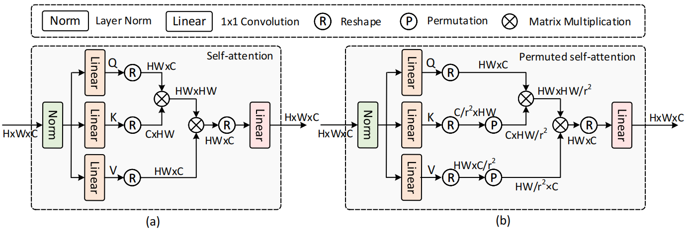
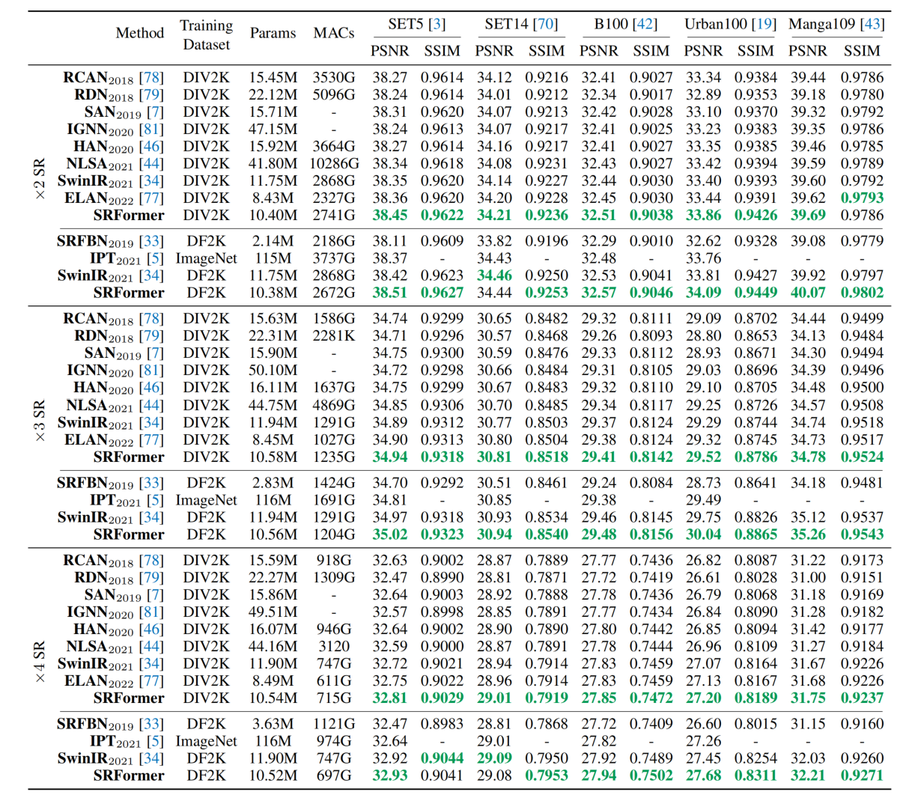
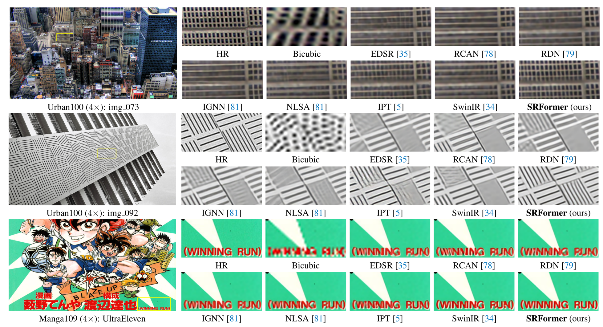
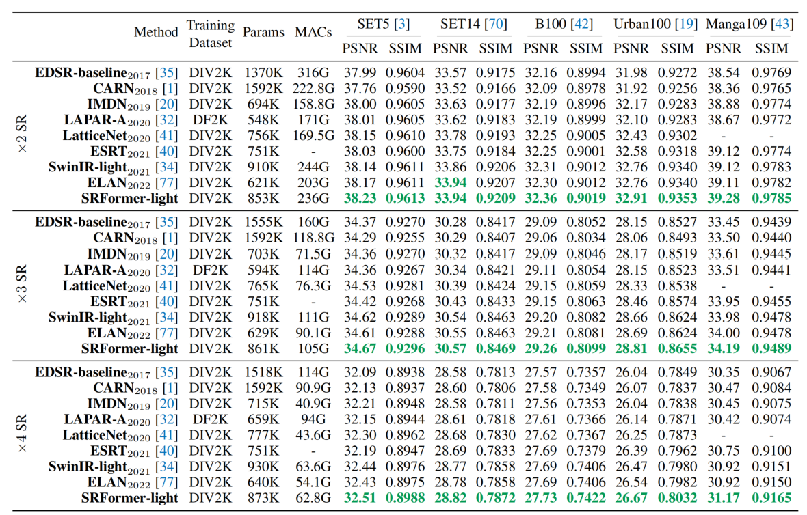
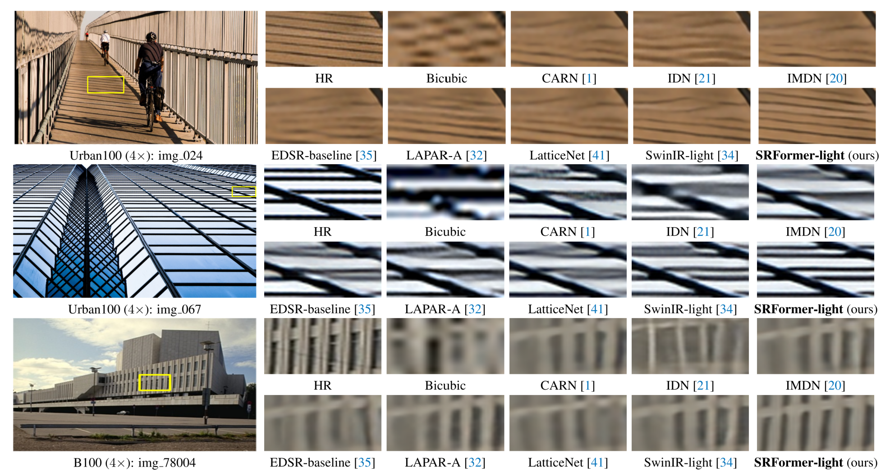
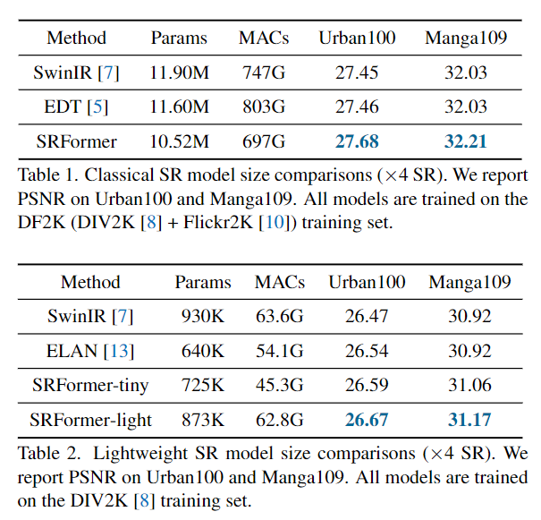
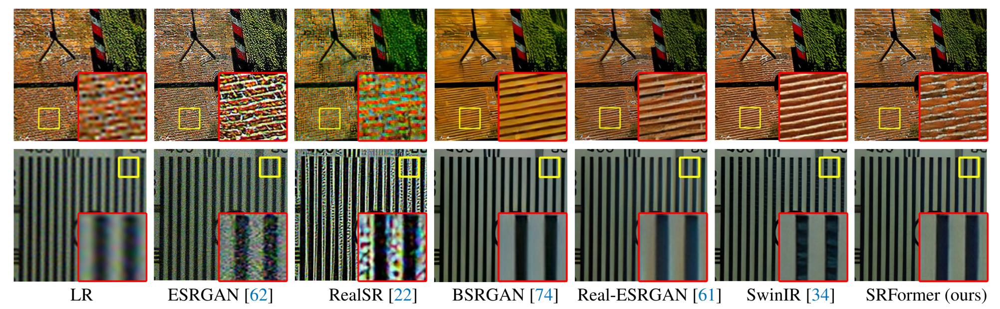

# SRFormer: Permuted Self-Attention for Single Image Super-Resolution (ICCV2023)
This repository contains the official implementation of the following paper:
> SRFormer: Permuted Self-Attention for Single Image Super-Resolution <br>
> Yupeng Zhou <sup>1</sup>, Zhen Li <sup>1</sup>, Chun-Le Guo <sup>1</sup>, Song Bai <sup>2</sup>, Ming-Ming Cheng <sup>1</sup>, Qibin Hou <sup>1</sup>  <br>
> <sup>1</sup>TMCC, School of Computer Science, Nankai University  <br>
> <sup>2</sup>ByteDance, Singapore <br>
> In ICCV 2023 

[\[Paper\]](https://openaccess.thecvf.com/content/ICCV2023/papers/Zhou_SRFormer_Permuted_Self-Attention_for_Single_Image_Super-Resolution_ICCV_2023_paper.pdf) [\[Code\]](https://github.com/HVision-NKU/SRFormer) [\[Pretrained Model\]](#pretrain-models) [\[Visual Results\]](https://drive.google.com/drive/folders/1t_yvM5jRJn-YTz-po5tGj3xITItLbeCl?usp=sharing) [Demo]

## Brief Introduction of Our Work
SRFormer is a new image SR backbone with SOTA performance. The core of SRFormer is **PSA**, a **simple**, **efficient** and **effective** attention mechanism, allowing to build  large range pairwise correlations with even less computational burden than original WSA of SwinIR. 
SRFormer ([ICCV open access link](https://openaccess.thecvf.com/content/ICCV2023/papers/Zhou_SRFormer_Permuted_Self-Attention_for_Single_Image_Super-Resolution_ICCV_2023_paper.pdf)) achieves **state-of-the-art performance** in
- classical image SR
- lightweight image SR
- real-world image SR


The table below are performance comparison with SwinIR under same training strategy on DIV2K dataset (X2 SR), SRFormer greatly outperform SwinIR with less Paramaters(10.40M vs 11.75M) and Flops(2741G vs 2868G), More results can be found [here](#result).

| model          | Set5  | Set14  | B100   | Urban100 | Manga109 |
|----------------|-------|--------|--------|----------|----------|
| SwinIR         | 38.35 |  34.14 |  32.44 | 33.40    | 39.60    |
| SRFormer（ours） | 38.45 | 34.21  | 32.51  | 33.86    | 39.69    |


## Method Overview
<!-- <p align="center">  </p> -->


---

> <b>Abstract</b>: In this paper, we introduce SRFormer, a simple yet effective Transformer-based model for single image super-resolution. We rethink the design of the popular shifted window self-attention, expose and analyze several characteristic issues of it, and present permuted self-attention
(PSA). PSA strikes an appropriate balance between the channel and spatial information for self-attention, allowing each Transformer block to build pairwise correlations within large windows with even less computational burden.
Our permuted self-attention is simple and can be easily applied to existing super-resolution networks based on Transformers. Without any bells and whistles, we show that our SRFormer achieves a 33.86dB PSNR score on the Urban100 dataset, which is 0.46dB higher than that of SwinIR but uses
fewer parameters and computations. We hope our simple and effective approach can serve as a useful tool for future research in super-resolution model design. Our code is publicly available at https://github.com/HVision-NKU/SRFormer.
<p align="center">  </p>

## Apply our PSA Easily
You can apply PSA with just a few lines of code, significantly reducing computational complexity. We omit head_number, relative position encoding for simplicity, you can visit [here](https://github.com/HVision-NKU/SRFormer/blob/main/basicsr/archs/srformer_arch.py#L119) to view more detailed code.
```python
## Original MSA in SwinIR:
## qkv = self.qkv(x).reshape(B_, N, 3, self.num_heads, C // self.num_heads).permute(2, 0, 3, 1, 4)
#  PSA compress the channel dimension of KV :(num_windows*b, n//4, c):
kv = self.kv(x).reshape(b_,self.permuted_window_size[0],2,self.permuted_window_size[1],2,2,c//4).permute(0,1,3,5,2,4,6).reshape(b_, n//4, 2,-1).permute(2, 0, 1, 3)
# PSA keep the channel dimension of Q: (num_windows*b,  n, c)
q = self.q(x).reshape(b_, n,-1).permute(2, 0, 1)
attn = (q @ k.transpose(-2, -1))   # (num_windows*b, num_heads, n, n//4)
x = (attn @ v).transpose(1, 2).reshape(b_, n, c)   # (num_windows*b,  n, c)
x = self.proj(x)
```
## Detail Contents
1. [Installation & Dataset](#installation--dataset)
2. [Training](#Training)
3. [Testing](#Testing)
4. [Upscaling your own pictutres](#inferring-your-own-lr-pictures)
5. [Results](#results)
6. [Pretrain Models](#pretrain-models)
7. [Citations](#citations)
8. [License](#license)
9. [Acknowledgement](#acknowledgement)

## Installation & Dataset
- python 3.8
- pyTorch >= 1.7.0

```bash
cd SRFormer
pip install -r requirements.txt
python setup.py develop
```
### Dataset
We use the same training and testing sets as SwinIR, the following datasets need to be downloaded for training.

| Task                                                |                                                                                                                                                                                                                                                                                                                                                                                                                                                                                                                                        Training Set                                                                                                                                                                                                                                                                                                                                                                                                                                                                                                                                         | Testing Set |
|:----------------------------------------------------|:-------------------------------------------------------------------------------------------------------------------------------------------------------------------------------------------------------------------------------------------------------------------------------------------------------------------------------------------------------------------------------------------------------------------------------------------------------------------------------------------------------------------------------------------------------------------------------------------------------------------------------------------------------------------------------------------------------------------------------------------------------------------------------------------------------------------------------------------------------------------------------------------------------------------------------------------------------------------------------------------------------------------------------------------------------------------------------------------:|     :---:         |
| classical image SR                      |                                                                                                                                                                                                                                                                                                                                                                                                                                                               [DIV2K](https://cv.snu.ac.kr/research/EDSR/DIV2K.tar) (800 training images) or DIV2K +[Flickr2K](https://cv.snu.ac.kr/research/EDSR/Flickr2K.tar) (2650 images)                                                                                                                                                                                                                                                                                                                                                                                                                                                               | Set5 + Set14 + BSD100 + Urban100 + Manga109 [Download all](https://drive.google.com/drive/folders/1B3DJGQKB6eNdwuQIhdskA64qUuVKLZ9u) |
| lightweight image SR                      |                                                                                                                                                                                                                                                                                                                                                                                                                                                               [DIV2K](https://cv.snu.ac.kr/research/EDSR/DIV2K.tar) (800 training images)                                                                                                                                                                                                                                                                                                                                                                                                                                                               | Set5 + Set14 + BSD100 + Urban100 + Manga109 [Download all](https://drive.google.com/drive/folders/1B3DJGQKB6eNdwuQIhdskA64qUuVKLZ9u)  |
| real-world image SR                                 | [DIV2K](https://cv.snu.ac.kr/research/EDSR/DIV2K.tar) (800 training images) +[Flickr2K](https://cv.snu.ac.kr/research/EDSR/Flickr2K.tar) (2650 images) + [OST](https://openmmlab.oss-cn-hangzhou.aliyuncs.com/datasets/OST_dataset.zip) (10324 images for sky,water,grass,mountain,building,plant,animal) | RealSRSet+5images|

#### Please note in Datasets Preparation
* If you do not use lmdb datasets, you may need to crop the training images into sub_images for reducing I/O times. Please follow [here](https://github.com/XPixelGroup/BasicSR/blob/master/docs/DatasetPreparation.md#DIV2K).
* After downloading the test datasets you need, you maybe need to get the downsample LR image, Please follow [here](https://github.com/yulunzhang/RCAN#the-whole-test-pipeline).
* Our Code requires the HR image and the corresponding LR image to have the same name. (e.g 001_HR.img and 001_LR.img is invalid. Please rename both of them to 001.img and save them in HR dir and LR dir specified in config.) Use `rename` command of linux can easily do it.


## Training


1. Please download the dataset corresponding to the task and place them in the folder specified by the training option in folder `/options/train/SRFormer`
2. Follow the instructions below to  train our SRFormer.

**Please note:** "4" in the following instructions means four GPUs. Please modify it according to your configuration. You are also encouraged to modify the YAML file in  "options/train/SRFormer/" to set more training settings.

```bash
# train SRFormer for classical SR task
./scripts/dist_train.sh 4 options/train/SRFormer/train_SRFormer_SRx2_scratch.yml
./scripts/dist_train.sh 4 options/train/SRFormer/train_SRFormer_SRx3_scratch.yml
./scripts/dist_train.sh 4 options/train/SRFormer/train_SRFormer_SRx4_scratch.yml
# train SRFormer for lightweight SR task
./scripts/dist_train.sh 4 options/train/SRFormer/train_SRFormer_light_SRx2_scratch.yml
./scripts/dist_train.sh 4 options/train/SRFormer/train_SRFormer_light_SRx3_scratch.yml
./scripts/dist_train.sh 4 options/train/SRFormer/train_SRFormer_light_SRx4_scratch.yml
```


## Testing


```bash
# test SRFormer for classical SR task
python basicsr/test.py -opt options/test/SRFormer/test_SRFormer_DF2Ksrx2.yml
python basicsr/test.py -opt options/test/SRFormer/test_SRFormer_DF2Ksrx3.yml
python basicsr/test.py -opt options/test/SRFormer/test_SRFormer_DF2Ksrx4.yml
# test SRFormer for lightweight SR task
python basicsr/test.py -opt options/test/SRFormer/test_SRFormer_light_DIV2Ksrx2.yml
python basicsr/test.py -opt options/test/SRFormer/test_SRFormer_light_DIV2Ksrx3.yml
python basicsr/test.py -opt options/test/SRFormer/test_SRFormer_light_DIV2Ksrx4.yml
```

## Inferring your own LR pictures

We provide a script which you can use our pretrained models to upscale your own pictures. We will also release our realworld pretrained models soon.  

```bash
# use SRFormer for classical SR task
python basicsr/infer_sr.py -opt options/test/SRFormer/test_SRFormer_DF2Ksrx2.yml  --input_dir {dir of your pictures} --output_dir {dir of output}
python basicsr/infer_sr.py -opt options/test/SRFormer/test_SRFormer_DF2Ksrx3.yml --input_dir {dir of your pictures} --output_dir {dir of output}
python basicsr/infer_sr.py -opt options/test/SRFormer/test_SRFormer_DF2Ksrx4.yml --input_dir {dir of your pictures} --output_dir {dir of output}
# use SRFormer for lightweight SR task
python basicsr/infer_sr.py -opt options/test/SRFormer/test_SRFormer_light_DIV2Ksrx2.yml --input_dir {dir of your pictures} --output_dir {dir of output}
python basicsr/infer_sr.py -opt options/test/SRFormer/test_SRFormer_light_DIV2Ksrx3.yml --input_dir {dir of your pictures} --output_dir {dir of output}
python basicsr/infer_sr.py -opt options/test/SRFormer/test_SRFormer_light_DIV2Ksrx4.yml --input_dir {dir of your pictures} --output_dir {dir of output}
```

## Results
<a id="result"></a>
We provide the results on classical image SR, lightweight image SR, realworld image SR. More results can be found in the [paper](). The visual results of SRFormer can be found in [\[Visual Results\]](https://drive.google.com/drive/folders/1t_yvM5jRJn-YTz-po5tGj3xITItLbeCl?usp=sharing).


Classical image SR 

- Results of Table 4 in the  paper

<p align="center">
  
</p>

- Results of Figure 4 in the paper

<p align="center">
  
</p>


Lightweight image SR 

- Results of Table 5 in the  paper

<p align="center">
  
</p>

- Results of Figure 5 in the  paper

<p align="center">
  
</p>


Model size comparison

- Results of Table 1 and Table 2 in the  Supplementary Material

<p align="center">
  
</p>


Realworld image SR 

- Results of Figure 8 in the  paper

<p align="center">
  
</p>


## Pretrain Models

Official pretrain models can be download from [google drive](https://drive.google.com/drive/folders/1D5ER_HwYJoyZCcrKVstwE-iEl0hXulwd?usp=sharing).
To reproduce the results in the article, you can download them and put them in the `/PretrainModel` folder.

Also, we thank @Phhofm for training a third-party pretrain model, you can visit [here](https://github.com/HVision-NKU/SRFormer/issues/10) to learn more.

## Citations
You may want to cite:
```
@article{zhou2023srformer,
  title={SRFormer: Permuted Self-Attention for Single Image Super-Resolution},
  author={Zhou, Yupeng and Li, Zhen and Guo, Chun-Le and Bai, Song and Cheng, Ming-Ming and Hou, Qibin},
  journal={arXiv preprint arXiv:2303.09735},
  year={2023}
}
```
---

## License
This code is licensed under the [Creative Commons Attribution-NonCommercial 4.0 International](https://creativecommons.org/licenses/by-nc/4.0/) for non-commercial use only.
Please note that any commercial use of this code requires formal permission prior to use.

## Acknowledgement
The codes are based on  [BasicSR](https://github.com/XPixelGroup/BasicSR), [Swin Transformer](https://github.com/microsoft/Swin-Transformer), and [SwinIR](https://github.com/JingyunLiang/SwinIR). Please also follow their licenses. Thanks for their awesome works.
